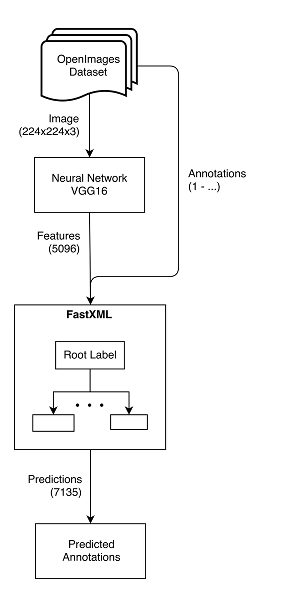

# Training a multi-label FastXML classifier on the OpenImages dataset

[OpenImages Dataset](https://github.com/openimages/dataset)

## Used architecture

<p align="center">
    
</p>

## Instructions

### Download images, prepare repo
Download the vgg models, annotations and initialize the submodules:
```bash
./bootstrap.sh
```

See the `bootstrap.sh` for options.

### Download images
Download the images from this [torrent](https://github.com/openimages/dataset/issues/11#issuecomment-257250800) to a `$IMAGES_FOLDER` of your choice.

### Extract image ids
Extract the `images.txt` with the image ids by:
```bash
# $IMAGES_FOLDER is the folder where you downloaded the torrent
# $DATA_PATH is the folder where in the next step the features get extracted to
find $IMAGES_FOLDER -name '*.jpg' > $DATA_PATH/images.txt
```

### VGG16 feature extraction
Run the vgg16 feature extraction by:
```bash
./tmp/cluster_scripts/run-vgg-extraction.sh fc6,fc7
```

You have to adapt the script first!

The first parameter to the `run-vgg-extraction.sh` script specifies the layers to be extracted, seperated by comma (eg. in the above case fc6 and fc7).

After executing this script the features will reside in the data folder (see script).
The filename is `features.LAYERS_TO_BE_EXTRACTED.txt`.
It is an CSV where the first column is the file id, the following columns are the features.

### Format change
The format of the VGG16 feature extraction is a CSV with the image ids and the features.

To train the __FastXML__ classifier with these features, the format has to be changed to the sparse matrix format for __FastXML__.

First you have to extract the annotations:
```bash
./dataset/extract-csv-columns.sh dataset/download/human_ann_2016_08/validation/labels.csv 1,3
grep -v ",0\.0" dataset/download/human_ann_2016_08/validation/labels_1_3.csv > dataset/download/human_ann_2016_08/validation/labels_1_3_correct.csv
```
The imageid/labels pairs will now reside in `dataset/download/human_ann_2016_08/validation/labels_1_3_correct.csv`.

Now add the classes to the features.
```bash
./tmp/format_convert_scripts/add_classes_to_features.py \
    --features-file $IN_FEATURES_FILE \
    --features-labels-file $OUT_FEATURES_WITH_CLASSES \
    --labels-npy dataset/download/human_ann_2016_08/validation/labels_1_3_correct.csv.npy \
    --labels dataset/download/human_ann_2016_08/validation/labels_1_3_correct.csv
```
`$IN_FEATURES_FILE`: the features from the feature extraction step (eg. `features.LAYERS_TO_BE_EXTRACTED.txt`).

`$OUT_FEATURES_WITH_CLASSES`: the file where the imageid/features/classes CSVs are saved to.

See the script `./tmp/format_convert_scripts/add_classes_to_features.py` for more options and explanations.

Extract the classes from the annotations:
```bash
cut -d , -f 1 dataset/download/human_ann_2016_08/validation/labels.csv | sort | uniq > dataset/download/human_ann_2016_08/validation/labels.sorted.csv
```

Now the format can be changed to the __FastXML__ format:
```bash
./tmp/format_convert_scripts/cpp_fastxml_format.py  \
    --features-labels-file $OUT_FEATURES_WITH_CLASSES \
    --classes-sorted-file dataset/download/human_ann_2016_08/validation/labels.sorted.csv \
    --features-out-file $OUT_FEATURES_FASTXML \
    --classes-out-file $OUT_CLASSES_FASTXML
```
See script for explanation.

To convert to the __MULAN__ format:
```bash
./tmp/format_convert_scripts/convert_to_mulan.py \
    --classes-in-file $OUT_CLASSES_FASTXML \
    --features-in-file $OUT_FEATURES_FASTXML \
    --out-file $OUT_MULAN
```
See script for explanation.

### Train FastXML classifier
Now train the cpp classifier:
```bash
./tmp/cluster_scripts/run-fastxml-cluster.sh \
    $DATA_DIR \
    $NUM_THREADS \
    $NUM_THREADS_TEST \
    $START_TREE \
    $NUM_TREE \
    $BIAS \
    $LOG_LOSS_COEFF \
    $MAX_LEAF \
    $LBL_PER_LEAF
```
`$DATA_DIR`: the directory where the classes and features reside (eg. `$OUT_FEATURES_FASTXML` and `$OUT_CLASSES_FASTXML` from the last step).

See the report for explanations for the other FastXML hyperparameters.

See the script `./tmp/cluster_scripts/run-fastxml-cluster.sh` for the functionality.

## Dataset

### images
- CSV Headers
    - 1  ImageID
    - 2  Subset
    - 3  OriginalURL
    - 4  OriginalLandingURL
    - 5  License
    - 6  AuthorProfileURL
    - 7  Author
    - 8  Title
    - 9  OriginalSize
    - 10 OriginalMD5
    - 11 Thumbnail300KURL
- train
    - Total:      9.011.220
    - Size:       18.3 TB
- validation
    - Total:      167.057
    - Size:       309.9 GB

### annotations
- CSV Headers
    - 1 ImageID
    - 2 Source
    - 3 LabelName
    - 4 Confidence
- MISPREDICTED
    - Ratio:  31% (false positives)
    - Most:   "produce, flower, plant, food, sports, shrub, human body"
- human
    - validation
        - Total:      1.741.385
        - Confidences:
            - 0.0     31.5%
            - 1.0     68.5%
        - Images that have no positive label: ca. 2000

- machine
    - validation
        - Total:      2.060.221
        - Confidences:
            - 0.5     14.5%
            - 0.6     22.2%
            - 0.7     20.5%
            - 0.8     17.4%
            - 0.9     18.4%
            - 1.0      7.0%
    - train
        - Total:      79.196.416
        - Confidences:
            - 0.5     12.3%
            - 0.6     22.0%
            - 0.7     21.3%
            - 0.8     20.5%
            - 0.9     19.8%
            - 1.0      4.0%

## Useful commands

**Headers**

head -n 1 $FILE

**Linecount**

wc -l $FILE

**Extract 4th column**

cat $FILE | cut -d , -f 4 > $NEW_FILE

**http://bconnelly.net/working-with-csvs-on-the-command-line/**

[working-with-data-on-the-command-line](http://www.datamazing.co.uk/2014/01/25/working-with-data-on-the-command-line)

cat file.csv | sed -e 's/,,/, ,/g' | column -s, -t

**Top10 mispredicted**

head -n 10 download/human_ann_2016_08/validation/labels_mispredicted_wc.csv | cut -d , -f 1 | ./labelnames.sh

cat labels.csv | grep -E '/m/036qh8.*,0.0' > labels_mispredicted_wc2.csv